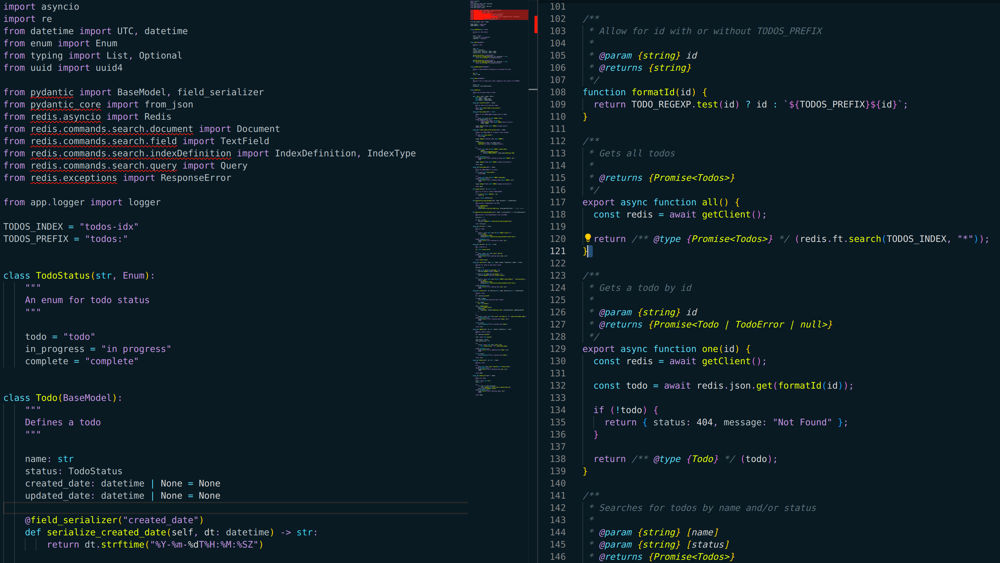

# redis.vscode-theme

This is the official VS Code theme for Redis, using the brand colors.



## Usage

This isn't published as a VS Code extension, so to use it you will need to clone the repository and install it yourself.

```bash
git clone https://github.com/redis-developer/redis.vscode-theme.git
```

### Requirements

1. [VS Code](https://code.visualstudio.com/)
2. [bun](https://bun.sh/)

### Deployment

```
bun run deploy
```

### Modifications

All the colors are in `colors.js` and the configuration is in `index.js`

### Contributions

PRs are welcomed.
